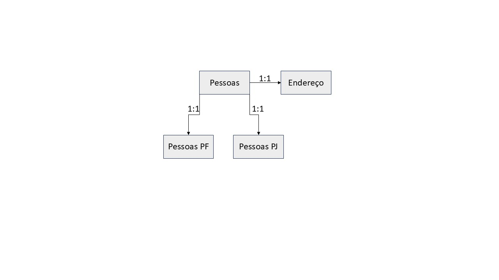

# Projeto Crud Cadastro de Pessoas

Projeto de exemplo de cadastro de pessoas com funcionalidades básicas de CRUD utilizando Java, Spring Boot, JPA e H2 Database.

### Modelagem de dados

Devido ao requisito de existir as entidades Pessoa Fisica, Pessoa Juridica e Endereço foi necessário criar uma modelagem de dados que representasse essa relação de herança entre as entidades.
Conforme imagem abaixo:

()

### APIs
As APIs foram desenvolvidas utilizando Spring Boot e seguem os princípios RESTful.
Conforme modelagem de dados, é necessário seguir a ordem de criação, Pessoas > Entidades filhas.
Dentro da pasta CadastroPessoas/local existe as collections para uso/teste das APIs para uso no HttpClient Bruno API Client em https://www.usebruno.com/.   

Pessoas APIs:

{GET [/api/pessoa/]}	PessoaController#findAll
{POST [/api/pessoa/]}	PessoaController#addPessoa
{PUT [/api/pessoa/{id}]}	PessoaController#updPessoa
{DELETE [/api/pessoa/{id}]}	PessoaController#deletePessoa
{GET [/api/pessoa/{id}]}	PessoaController#findById

Endereço das Pessoas APIs:
{GET [/api/endereco/]}	EnderecoController#findAll
{POST [/api/endereco/]}	EnderecoController#addEndereco
{PUT [/api/endereco/{id}]}	EnderecoController#updEndereco
{DELETE [/api/endereco/{id}]}	EnderecoController#deleteEndereco
{GET [/api/endereco/{id}]}	EnderecoController#findById
{GET [/api/endereco/pessoa/{id}]}	EnderecoController#findByPessoaId
{PUT [/api/endereco/principal/{id}]}	EnderecoController#setEnderecoPrincipal

### Tecnologias Utilizadas
- Java 24
- Spring Boot
- Spring Data JPA
- H2 Database
- Maven
- JUnit e Mockito para testes unitários
- Lombok para reduzir boilerplate code
- ModelMapper para mapeamento entre entidades e DTOs
 
### Como Executar o Projeto
1. Clone o repositório: `git clone
2. Navegue até o diretório do projeto: `cd CadastroPessoas`
3. Entre na pasta local `cd local` e execute o comando: docker compose up
4. Abra o HttpClient HttpClient Bruno API Client em https://www.usebruno.com/ e importe a collection que está na pasta CadastroPessoas/CadastroPessoasCollections
5. Se divitirta testando as APIs!

### Cobertura de Código
Foi feita cobertura de código sobre 100% dos Services e Controllers utilizando JUnit e Mockito.

